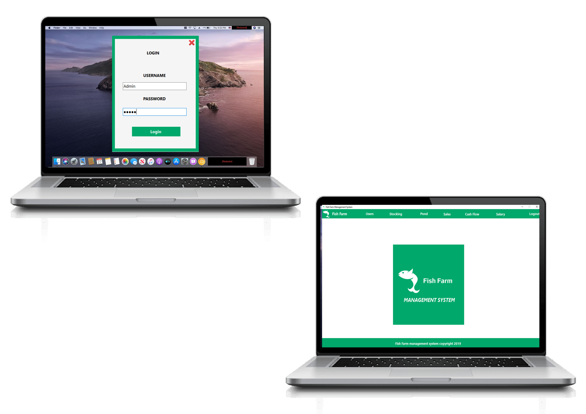

<h1>Fish Farm Management System(FFMS)</h1>
            
This is project I did for a client while I'm doing my National Youth Service Corps(NYSC) at Small and Medium Entreprises Development Agency at Abuja. The FFMS is basically a management system for a fish farm.

            
            
The system  have the following functionalities: 

            <ul>
                <li>Inventory Management</li>
                <li>Water Quality Monitoring</li>
                <li>Feeding Management</li>
                <li>Stock Tracking</li>
                <li>Harvesting and Processing</li>
                <li>Fish Health Monitoring</li>
                <li>Pond or Tank Management</li>
                <li>Equipment Maintenance</li>
                <li>Employee Management</li>
                <li>Sales and Distribution</li>
                <li>Financial Management</li>
                <li>Forecasting and Analytics</li>
                <li>Regulatory Compliance</li>
                <li>Environmental Monitoring</li>
                <li>Customer Relationship Management (CRM)</li>
                <li>Reporting and Documentation</li>
                <li>Alerts and Notifications</li>
                <li>Integration with IoT Devices</li>
            </ul>
